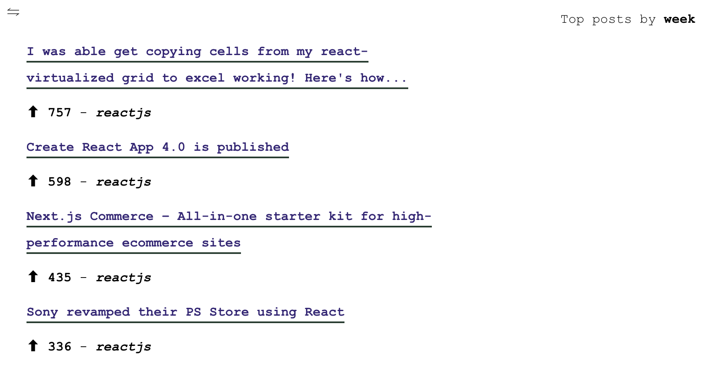

# reddit-dev

> App that fetches from Reddit API and displays it in a very barebones UI.

## Stack

* React (`create-react-app`)
* TypeScript
* `@emotion/styled` for "styling"
* `useReducer` and `Context` for state-management
* `jest`, `@testing-library/react` and `msw` for testing
